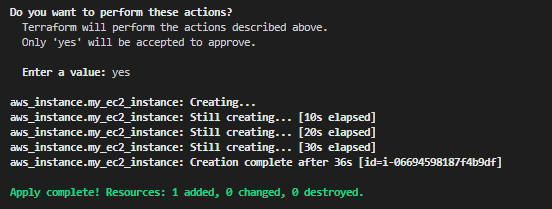
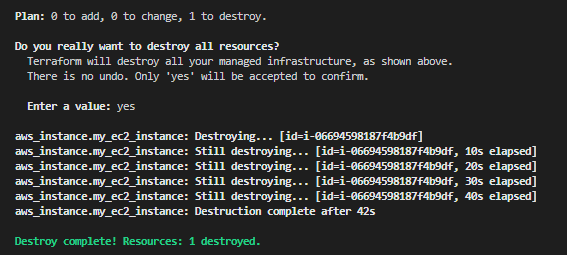

# **Terraform**


# **Table of Contents**

* [**Evolution of Cloud and Infrastructure as Code**](#evolution-of-cloud-and-infrastructure-as-code) <!-- style="font-size:20px" -->
* [**Terraform Overview & Set Up**](#terraform-overview-and-set-up) <!-- style="font-size:20px" -->
* [**Basic Terraform Usage**](#basic-terraform-usage) <!-- style="font-size:20px" -->
* [**Variables and Outputs**](#variables-and-outputs) <!-- style="font-size:20px" -->
* [**Additional HCL Features**](#additional-hcl-features) <!-- style="font-size:20px" -->
* [**Terraform Modules**](#terraform-modules) <!-- style="font-size:20px" -->
* [**Managing Multiple Environments**](#managing-multiple-environments) <!-- style="font-size:20px" -->
* [**Testing Terraform Code**](#testing-terraform-code) <!-- style="font-size:20px" -->
* [**Developer Workflows**](#developer-workflows) <!-- style="font-size:20px" -->

## **Evolution of Cloud and Infrastructure as Code** <!-- style="font-size:20px" -->

* [**Evolution of Cloud Infrastructure**](#evolution-of-cloud-infrastructure) <!-- style="font-size:20px" -->
* [**Infrastructure as Code Overview**](#infrastructure-as-code-overview) <!-- style="font-size:20px" -->

### **Evolution of Cloud Infrastructure**

In the early 90s and 2000s, tech companies building web applications had to go through a cumbersome process.

They needed to devise their idea, write the software, purchase servers, set up data centers, and handle all the power management, networking, and operational overhead. This process was challenging and time-consuming, often requiring significant capital expenses.

 

With the advent of cloud computing in the late 2000s and 2010s, the process changed drastically. After developing an idea and writing the software, companies could now deploy their applications to the cloud.

 

**Key Advantages of Cloud Infrastructure:**

**Infrastructure available via APIs**: Rather than needing to purchase and set up infrastructure, API driven systems can spin up or spin down servers as needed within minutes. This on-demand resource model made infrastructure management faster and more efficient.

**Speed and Flexibility**: The ability to scale infrastructure up or down quickly in response to changing demands, like during high-traffic events such as Black Friday sales.

**Shift in Mindset**: Infrastructure is now viewed as short-lived and immutable, as opposed to the long-lived and mutable model of traditional data centers. This means that when changes or updates are needed, new servers with the required dependencies are provisioned, and old ones are torn down.

### **Infrastructure as Code Overview**

Three Main Approaches for Provisioning Cloud Resources:

**1. Cloud Console**: A graphical user interface provided by cloud providers, allowing users to interact with and manage cloud services.

**2. API or Command-Line Interface**: A method of interacting with cloud services programmatically, allowing for more efficient and automated management.

**3. Infrastructure as Code**: Defining your entire infrastructure within your codebase, offering better control, visibility, and consistency across environments.

**Categories of Infrastructure as Code Tools:** <!-- style="font-size:20px" -->

**1. Ad-hoc scripts**: Basic scripts that make API calls to provision infrastructure resources (e.g., shell scripts).

**2. Configuration management tools**: Tools like Ansible, Puppet, and Chef, designed to manage software and infrastructure configuration.

**3. Server templating tools**: Tools for building server templates, such as Amazon Machine Images (AMIs) or virtual machine images.

**4. Orchestration tools**: Tools like Kubernetes, which focus on deploying applications and managing containers.

**5. Provisioning tools**: Tools like Terraform, which focus on provisioning cloud resources using a declarative approach.

**Declarative vs. Imperative:** <!-- style="font-size:20px" -->

* Declarative tools define the desired end state of your infrastructure (e.g., five servers, one load balancer), and the tool handles the API calls and processes to achieve that state.
* Imperative tools require you to define the sequence of actions to create the desired infrastructure.

**Cloud-Specific vs. Cloud-Agnostic:** <!-- style="font-size:20px" -->

* **Cloud-specific tools**: These tools, such as AWS CloudFormation or Azure Resource Manager, are provided by major cloud providers and focus on provisioning infrastructure within their respective clouds.

* **Cloud-agnostic tools**: Tools like Terraform or Pulumi, which can be used across any cloud provider, allowing for greater flexibility when deploying resources across multiple clouds or when using third-party services.

 

## **Terraform Overview and Set Up** 

* [**Terraform Overview**](#terraform-overview) <!-- style="font-size:20px" -->
* [**Setting up Terraform with AWS**](#setting-up-terraform-with-aws) <!-- style="font-size:20px" -->

### **Terraform Overview**

* [**What is Terraform**](#what-is-terraform) <!-- style="font-size:20px" -->
* [**Benefits of Terraform**](#benefits-of-terraform) <!-- style="font-size:20px" -->
* [**Terraform with Other Tools**](#terraform-with-other-tools) <!-- style="font-size:20px" -->
* [**Terraform Architecture**](#terraform-architecture) <!-- style="font-size:20px" -->

#### **What is Terraform**

* Terraform is a tool for building, changing, and versioning infrastructure safely and efficiently
* Enables application software best practices to infrastructure
* Compatible with many clouds and services


#### **Benefits of Terraform**

* Apply software development best practices to infrastructure management.
* Utilize version control to track infrastructure changes over time.
* Cloud-agnostic approach allows for compatibility with multiple cloud providers and services.
* Interact with almost any online service with an API.

#### **Terraform with Other Tools**

Terraform can be used in conjunction with other IaC tools to create powerful and flexible infrastructure management solutions. Some common patterns include:

**1.** Terraform + Configuration Management Tools (e.g., Ansible):

* Terraform provisions virtual machines
* Ansible installs and configures dependencies inside virtual machines.

**2.** Terraform + Templating Tools (e.g., Packer):

* I Terraform provisions servers.
* Packer builds the image from which virtual machines are created.

**3.** Terraform + Orchestration Tools (e.g., Kubernetes):

* Terraform provisions Kubernetes clusters.
* Kubernetes defines how the application is deployed and managed on the cloud resources.

#### **Terraform Architecture**

Terraform consists of two main components:


**1. Terraform Core:**

* The engine that processes configuration files and manages the Terraform state file.
* Responsible for interacting with cloud provider APIs to make the current state match the desired configuration.

**2. Terraform Providers:**

* Plugins for Terraform Core that allow it to interact with specific cloud providers and services.
* Map configuration and state information to the appropriate API calls.
* Over 100 providers available for various cloud providers and services.

### **Setting up Terraform with AWS**

* [**Installing Terraform**](#installing-terraform)
* [**Authenticating with AWS**](#authenticating-with-aws)
* [**Creating a Basic Terraform Configuration**](#creating-a-basic-terraform-configuration)

#### **Installing Terraform**

Installing Terraform on Windows requires you to download the correct Terraform package, unpack, and execute it via the CLI. Follow the instructions below to ensure you do not miss any steps.

To install in Mac or linux system Refere to this [link](https://developer.hashicorp.com/terraform/downloads)

**Step1 : Download Terraform File for Windows**
`
1. Browse to the [Download Terraform](https://developer.hashicorp.com/terraform/downloads) page.

2. Select the Windows tab under the Operating System heading. The latest version is preselected.


3. Choose the binary to download. Select 386 for 32-bit systems or AMD64 for 64-bit systems. Choose the download location for the zip file if the download does not start automatically.

4. Unzip the downloaded file. For example, use the C:\terraform path. Remember this location so you can add the path to the environment variables.

**Step2 : Add Terraform Path to System Environment Variables**

To add the Terraform executable to the system's global path:

1. Open the start menu, start typing environment and click Edit system environment variables. The System Properties window opens.  

2. Click the Environment Variables... button.


3. Select the Path variable in the System variables section to add terraform for all accounts. Alternatively, select Path in the User variables section to add terraform for the currently logged-in user only. Click Edit once you select a Path.


4. Click New in the edit window and enter the location of the Terraform folder.


5. Click OK on all windows to apply the changes.

**Step3 : Verify Windows Terraform Installation**

To check the Terraform global path configuration:

1. Open a new command-prompt window.

2. Enter the command to check the Terraform version: terraform -version

```markdown
terraform -version
```


The output shows the Terraform version you downloaded and installed on your Windows machine.

#### **Authenticating with AWS**

**Step1** : Create a user with the necessary IAM roles for your project. In this example, we used the following permissions:

* RDS access (AmazonRDSFullAccess)
* EC2 access (AmazonEC2FullAccess)
* IAM role management (IAMFullAccess)
* S3 access (AmazonS3FullAccess)
* DynamoDB access (AmazonDynamoDBFullAccess)
* Route 53 access (AmazonRoute53FullAccess)


**Step2** Install the AWS Command Line Interface (CLI) by following the instructions on the [AWS CLI installation page](https://aws.amazon.com/cli/).

if you facing the below error text click on the [link](image/install7.PNG)

```markdown
$ aws --version
command not found: aws
```

**Step3** Run aws configure and enter your access key ID, secret access key, and default region.

```markdown
aws configure
```


This will create a credentials file in your home directory at `~/.aws/credentials`.

#### **Creating a Basic Terraform Configuration**

**Step1.** Create a file named main.tf with the following content:

```markdown
terraform {
  required_providers {
    aws = {
      source  = "hashicorp/aws"
      version = "~> 3.0"
    }
  }
}

provider "aws" {
  region = "us-east-1"
}

resource "aws_instance" "example" {
  ami           = "ami-011899242bb902164" # Ubuntu 20.04 LTS // us-east-1
  instance_type = "t2.micro"
}
```

**Step2.** This basic configuration specifies the AWS provider and an EC2 instance resource using an Ubuntu 20.04 AMI and the t2.micro instance type.

**Using Terraform Commands:**

* Initialize Terraform in the directory containing main.tf by running `terraform init`. This sets up the backend and state storage.


* Run `terraform plan` to view the changes Terraform will make to your infrastructure.


* Run `terraform apply` to create the specified resources. Confirm the action when prompted.




* To clean up resources and avoid unnecessary costs, run `terraform destroy` and confirm the action when prompted.



By following these steps, you have installed Terraform, authenticated with AWS, and created a basic configuration to provision a virtual machine on AWS!

## **Basic Terraform Usage** 

* [**Terraform Providers + Init**](#terraform-providers-+-init) <!-- style="font-size:20px" -->
* [**Terraform State Management**](#terraform-state-management) <!-- style="font-size:20px" -->
* [**Terraform Plan, Apply, Destroy**](#terraform-plan-apply-destroy) <!-- style="font-size:20px" -->
* [**Remote Backend Considerations**](#remote-backend-considerations) <!-- style="font-size:20px" -->
* [**Sample Application Walkthrough**](#sample-application-walkthrough) <!-- style="font-size:20px" -->

### **Terraform Providers + Init**

**The General Sequence of Terraform Commands:**

**1.** **terraform init**: Initializes your project

**2.** **terraform plan**: Checks your configuration against the current state and generates a plan

**3.** **terraform apply**: Applies the plan to create or update your infrastructure

**4.** **terraform destroy**: Removes resources when no longer needed

<br>

* [**Terraform Providers**](#terraform-providers)
* [**Terraform Init Command**](#terraform-init-command)

#### **Terraform Providers** 

A provider is a plugin that lets Terraform manage an external API

Provider plugins like the AWS provider or the cloud-init provider act as a translation layer that allows Terraform to communicate with many different cloud providers, databases, and services.


* Visit [registry.terraform.io](https://registry.terraform.io/) to explore available providers
* Official providers have the "official" tag and are maintained by the respective cloud service
* In your configuration file, specify required providers and pin their versions within a terraform block

Example:

```markdown
required_providers {
    aws = {
      source  = "hashicorp/aws"
      version = "~> 3.0"
    }
  }
```

#### **Terraform Init Command**

This command performs several different initialization steps in order to prepare the current working directory for use with Terraform

* In an empty working directory, create a "**main.tf**" file containing your configuration

* Run `terraform init` to download the necessary providers and store them in the  "**.terraform**" directory. The  "**.terraform.lock.hcl**" file contains information about the installed dependencies and providers


* Modules, reusable Terraform code bundles, are also downloaded and stored in the "**.terraform**" directory.


### **Terraform State Management**

### **Terraform Plan Apply Destroy**

### **Remote Backend Considerations**

### **Sample Application Walkthrough**

## **Variables and Outputs**

* [**Variables and Outputs (Theory)**](#variables-and-outputs-theory) <!-- style="font-size:20px" -->
* [**Variables and Outputs (Applied)**](#variables-and-outputs-applied) <!-- style="font-size:20px" -->

### **Variables and Outputs Theory**

### **Variables and Outputs Applied**

## **Additional HCL Features**

## **Terraform Modules**

* [**Terraform Modules (Theory)**](#terraform-modules-theory) <!-- style="font-size:20px" -->
* [**Terraform Modules (Applied)**](#terraform-modules-applied) <!-- style="font-size:20px" -->

### **Terraform Modules Theory**

### **Terraform Modules Applied**

## **Managing Multiple Environments**

* [**Managing TF Environments**](#managing-tf-environments) <!-- style="font-size:20px" -->
* [**Using Terraform Workspaces**](#using-terraform-workspaces) <!-- style="font-size:20px" -->
* [**Using Subdirectory Environments**](#using-subdirectory-environments) <!-- style="font-size:20px" -->

### **Managing TF Environments**

### **Using Terraform Workspaces**

### **Using Subdirectory Environments**

## **Testing Terraform Code**

* [**Testing Terraform Code (Theory)**](#testing-terraform-code-theory) <!-- style="font-size:20px" -->
* [**Testing Terraform Code (Practice)**](#testing-terraform-code-practice) <!-- style="font-size:20px" -->

### **Testing Terraform Code Theory**

### **Testing Terraform Code Practice**

## **Developer Workflows**

* [**Developer Workflows**](#developer-workflows) <!-- style="font-size:20px" -->
* [**GitHub Actions Automation**](#github-actions-automation) <!-- style="font-size:20px" -->

### **Developer Workflows**

### **GitHub Actions Automation**