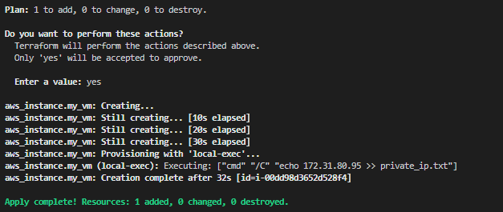
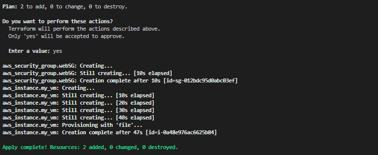
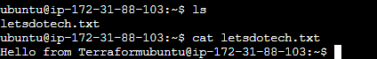
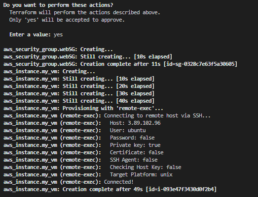
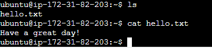
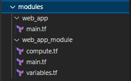

# **Terraform**


# **Table of Contents**

* [**Evolution of Cloud and Infrastructure as Code**](#evolution-of-cloud-and-infrastructure-as-code) <!-- style="font-size:20px" -->
* [**Terraform Overview & Set Up**](#terraform-overview-and-set-up) <!-- style="font-size:20px" -->
* [**Basic Terraform Usage**](#basic-terraform-usage) <!-- style="font-size:20px" -->
* [**Variables and Outputs**](#variables-and-outputs) <!-- style="font-size:20px" -->
* [**Additional HCL Features**](#additional-hcl-features) <!-- style="font-size:20px" -->
* [**Create Users Example**](#create-users-example) <!-- style="font-size:20px" -->
* [**Terraform Modules**](#terraform-modules) <!-- style="font-size:20px" -->
* [**Managing Multiple Environments**](#managing-multiple-environments) <!-- style="font-size:20px" -->
* [**Testing Terraform Code**](#testing-terraform-code) <!-- style="font-size:20px" -->
* [**Developer Workflows**](#developer-workflows) <!-- style="font-size:20px" -->
* [**References**](#references)

## **Evolution of Cloud and Infrastructure as Code** <!-- style="font-size:20px" -->

* [**Evolution of Cloud Infrastructure**](#evolution-of-cloud-infrastructure) <!-- style="font-size:20px" -->
* [**Infrastructure as Code Overview**](#infrastructure-as-code-overview) <!-- style="font-size:20px" -->

### **Evolution of Cloud Infrastructure**

In the early 90s and 2000s, tech companies building web applications had to go through a cumbersome process.

They needed to devise their idea, write the software, purchase servers, set up data centers, and handle all the power management, networking, and operational overhead. This process was challenging and time-consuming, often requiring significant capital expenses.

 

With the advent of cloud computing in the late 2000s and 2010s, the process changed drastically. After developing an idea and writing the software, companies could now deploy their applications to the cloud.

 

**Key Advantages of Cloud Infrastructure:**

**Infrastructure available via APIs**: Rather than needing to purchase and set up infrastructure, API driven systems can spin up or spin down servers as needed within minutes. This on-demand resource model made infrastructure management faster and more efficient.

**Speed and Flexibility**: The ability to scale infrastructure up or down quickly in response to changing demands, like during high-traffic events such as Black Friday sales.

**Shift in Mindset**: Infrastructure is now viewed as short-lived and immutable, as opposed to the long-lived and mutable model of traditional data centers. This means that when changes or updates are needed, new servers with the required dependencies are provisioned, and old ones are torn down.

### **Infrastructure as Code Overview**

Three Main Approaches for Provisioning Cloud Resources:

**1. Cloud Console**: A graphical user interface provided by cloud providers, allowing users to interact with and manage cloud services.

**2. API or Command-Line Interface**: A method of interacting with cloud services programmatically, allowing for more efficient and automated management.

**3. Infrastructure as Code**: Defining your entire infrastructure within your codebase, offering better control, visibility, and consistency across environments.

**Categories of Infrastructure as Code Tools:** <!-- style="font-size:20px" -->

**1. Ad-hoc scripts**: Basic scripts that make API calls to provision infrastructure resources (e.g., shell scripts).

**2. Configuration management tools**: Tools like Ansible, Puppet, and Chef, designed to manage software and infrastructure configuration.

**3. Server templating tools**: Tools for building server templates, such as Amazon Machine Images (AMIs) or virtual machine images.

**4. Orchestration tools**: Tools like Kubernetes, which focus on deploying applications and managing containers.

**5. Provisioning tools**: Tools like Terraform, which focus on provisioning cloud resources using a declarative approach.

**Declarative vs. Imperative:** <!-- style="font-size:20px" -->

* Declarative tools define the desired end state of your infrastructure (e.g., five servers, one load balancer), and the tool handles the API calls and processes to achieve that state.
* Imperative tools require you to define the sequence of actions to create the desired infrastructure.

**Cloud-Specific vs. Cloud-Agnostic:** <!-- style="font-size:20px" -->

* **Cloud-specific tools**: These tools, such as AWS CloudFormation or Azure Resource Manager, are provided by major cloud providers and focus on provisioning infrastructure within their respective clouds.

* **Cloud-agnostic tools**: Tools like Terraform or Pulumi, which can be used across any cloud provider, allowing for greater flexibility when deploying resources across multiple clouds or when using third-party services.

 

## **Terraform Overview and Set Up** 

* [**Terraform Overview**](#terraform-overview) <!-- style="font-size:20px" -->
* [**Setting up Terraform with AWS**](#setting-up-terraform-with-aws) <!-- style="font-size:20px" -->

### **Terraform Overview**

* [**What is Terraform**](#what-is-terraform) <!-- style="font-size:20px" -->
* [**Benefits of Terraform**](#benefits-of-terraform) <!-- style="font-size:20px" -->
* [**Terraform with Other Tools**](#terraform-with-other-tools) <!-- style="font-size:20px" -->
* [**Terraform Architecture**](#terraform-architecture) <!-- style="font-size:20px" -->

#### **What is Terraform**

* Terraform is a tool for building, changing, and versioning infrastructure safely and efficiently
* Enables application software best practices to infrastructure
* Compatible with many clouds and services


#### **Benefits of Terraform**

* Apply software development best practices to infrastructure management.
* Utilize version control to track infrastructure changes over time.
* Cloud-agnostic approach allows for compatibility with multiple cloud providers and services.
* Interact with almost any online service with an API.

#### **Terraform with Other Tools**

Terraform can be used in conjunction with other IaC tools to create powerful and flexible infrastructure management solutions. Some common patterns include:

**1.** Terraform + Configuration Management Tools (e.g., Ansible):

* Terraform provisions virtual machines
* Ansible installs and configures dependencies inside virtual machines.

**2.** Terraform + Templating Tools (e.g., Packer):

* I Terraform provisions servers.
* Packer builds the image from which virtual machines are created.

**3.** Terraform + Orchestration Tools (e.g., Kubernetes):

* Terraform provisions Kubernetes clusters.
* Kubernetes defines how the application is deployed and managed on the cloud resources.

#### **Terraform Architecture**

Terraform consists of two main components:


**1. Terraform Core:**

* The engine that processes configuration files and manages the Terraform state file.
* Responsible for interacting with cloud provider APIs to make the current state match the desired configuration.

**2. Terraform Providers:**

* Plugins for Terraform Core that allow it to interact with specific cloud providers and services.
* Map configuration and state information to the appropriate API calls.
* Over 100 providers available for various cloud providers and services.

### **Setting up Terraform with AWS**

* [**Installing Terraform**](#installing-terraform)
* [**Authenticating with AWS**](#authenticating-with-aws)
* [**Creating a Basic Terraform Configuration**](#creating-a-basic-terraform-configuration)

#### **Installing Terraform**

Installing Terraform on Windows requires you to download the correct Terraform package, unpack, and execute it via the CLI. Follow the instructions below to ensure you do not miss any steps.

To install in Mac or linux system Refere to this [link](https://developer.hashicorp.com/terraform/downloads)

**Step1 : Download Terraform File for Windows**

1. Browse to the [Download Terraform](https://developer.hashicorp.com/terraform/downloads) page.

2. Select the Windows tab under the Operating System heading. The latest version is preselected.


3. Choose the binary to download. Select 386 for 32-bit systems or AMD64 for 64-bit systems. Choose the download location for the zip file if the download does not start automatically.

4. Unzip the downloaded file. For example, use the C:\terraform path. Remember this location so you can add the path to the environment variables.

**Step2 : Add Terraform Path to System Environment Variables**

To add the Terraform executable to the system's global path:

1. Open the start menu, start typing environment and click Edit system environment variables. The System Properties window opens.  

2. Click the Environment Variables... button.


3. Select the Path variable in the System variables section to add terraform for all accounts. Alternatively, select Path in the User variables section to add terraform for the currently logged-in user only. Click Edit once you select a Path.


4. Click New in the edit window and enter the location of the Terraform folder.


5. Click OK on all windows to apply the changes.

**Step3 : Verify Windows Terraform Installation**

To check the Terraform global path configuration:

1. Open a new command-prompt window.

2. Enter the command to check the Terraform version: terraform -version

```markdown
terraform -version
```


The output shows the Terraform version you downloaded and installed on your Windows machine.

#### **Authenticating with AWS**

**Step1** : Create a user with the necessary IAM roles for your project. In this example, we used the following permissions:

* RDS access (AmazonRDSFullAccess)
* EC2 access (AmazonEC2FullAccess)
* IAM role management (IAMFullAccess)
* S3 access (AmazonS3FullAccess)
* DynamoDB access (AmazonDynamoDBFullAccess)
* Route 53 access (AmazonRoute53FullAccess)


**Step2** Install the AWS Command Line Interface (CLI) by following the instructions on the [AWS CLI installation page](https://aws.amazon.com/cli/).

if you facing the below error text click on the [link](image/install7.PNG)

```markdown
$ aws --version
command not found: aws
```

**Step3** Run aws configure and enter your access key ID, secret access key, and default region.

```markdown
aws configure
```


This will create a credentials file in your home directory at `~/.aws/credentials`.

#### **Creating a Basic Terraform Configuration**

**Step1.** Create a file named main.tf with the following content:

```markdown
terraform {
  required_providers {
    aws = {
      source  = "hashicorp/aws"
      version = "~> 3.0"
    }
  }
}

provider "aws" {
  region = "us-east-1"
}

resource "aws_instance" "example" {
  ami           = "ami-011899242bb902164" # Ubuntu 20.04 LTS // us-east-1
  instance_type = "t2.micro"
}
```

**Step2.** This basic configuration specifies the AWS provider and an EC2 instance resource using an Ubuntu 20.04 AMI and the t2.micro instance type.

**Using Terraform Commands:**

* Initialize Terraform in the directory containing main.tf by running `terraform init`. This sets up the backend and state storage.


* Run `terraform plan` to view the changes Terraform will make to your infrastructure.


* Run `terraform apply` to create the specified resources. Confirm the action when prompted.


* To clean up resources and avoid unnecessary costs, run `terraform destroy` and confirm the action when prompted.


By following these steps, you have installed Terraform, authenticated with AWS, and created a basic configuration to provision a virtual machine on AWS!

## **Basic Terraform Usage** 

* [**Terraform Providers + Init**](#terraform-providers-+-init) <!-- style="font-size:20px" -->
* [**Terraform State Management**](#terraform-state-management) <!-- style="font-size:20px" -->
* [**Terraform Plan,Apply & Destroy**](#terraform-plan,apply-&-destroy) <!-- style="font-size:20px" -->
* [**Remote Backend Considerations**](#remote-backend-considerations) <!-- style="font-size:20px" -->
* [**Sample Application Walkthrough**](#sample-application-walkthrough) <!-- style="font-size:20px" -->

### **Terraform Providers + Init**

**The General Sequence of Terraform Commands:**

**1.** **terraform init**: Initializes your project

**2.** **terraform plan**: Checks your configuration against the current state and generates a plan

**3.** **terraform apply**: Applies the plan to create or update your infrastructure

**4.** **terraform destroy**: Removes resources when no longer needed

<br>

* [**Terraform Providers**](#terraform-providers)
* [**Terraform Init Command**](#terraform-init-command)

#### **Terraform Providers** 

A provider is a plugin that lets Terraform manage an external API

Provider plugins like the AWS provider or the cloud-init provider act as a translation layer that allows Terraform to communicate with many different cloud providers, databases, and services.


* Visit [registry.terraform.io](https://registry.terraform.io/) to explore available providers
* Official providers have the "official" tag and are maintained by the respective cloud service
* In your configuration file, specify required providers and pin their versions within a terraform block

Example:

```markdown
required_providers {
    aws = {
      source  = "hashicorp/aws"
      version = "~> 3.0"
    }
  }
```

#### **Terraform Init Command**

This command performs several different initialization steps in order to prepare the current working directory for use with Terraform

* In an empty working directory, create a "**main.tf**" file containing your configuration

* Run `terraform init` to download the necessary providers and store them in the  "**.terraform**" directory. The  "**.terraform.lock.hcl**" file contains information about the installed dependencies and providers


* Modules, reusable Terraform code bundles, are also downloaded and stored in the "**.terraform**" directory.


### **Terraform State Management**

* The state file is a JSON file containing information about resources and data objects deployed using Terraform
* It includes metadata and other essential information about each resource
* The state file may contain sensitive information, so it must be protected and encrypted

The following is an example of a "**.tfstate**" file for a terraform config managing an s3 bucket:

```markdown
{
  "version": 4,
  "terraform_version": "1.0.0",
  "serial": 1,
  "lineage": "your-lineage-here",
  "outputs": {},
  "resources": [
    {
      "mode": "managed",
      "type": "aws_s3_bucket",
      "name": "example_bucket",
      "provider": "provider.aws",
      "instances": [
        {
          "attributes": {
            "acl": "private",
            "bucket": "example-bucket",
            "force_destroy": false,
            "id": "example_bucket",
            "region": "us-east-1",
            "tags": {}
          },
          "private": "bnVsbA=="
        }
      ]
    }
  ]
}
```

**Storing the State File:**

* [**Local Backend:**](#local-backend) The state file is stored within the working directory of the project
* [**Remote Backend:**](#remote-backend) The state file is stored in a remote object store or a managed service like Terraform Cloud

#### **Local Backend**

The local backend stores state on the local filesystem, locks that state using system APIs, and performs operations locally.


**Advantages:**

* Easy to set up and use
* Stores the state file alongside your code

**Disadvantages:**

* Stores sensitive values in plain text
* Not suitable for collaboration
* Requires manual interaction for applying changes

#### **Remote Backend**

Terraform stores state about managed infrastructure to map real-world resources to the configuration, keep track of metadata, and improve performance. Terraform stores this state in a local file by default, but you can also use a Terraform remote backend to store state remotely.


**Advantages:**

* Encrypts sensitive data
* Allows collaboration among multiple developers
* Supports automation through CI/CD pipelines

**Disadvantages:**

* Increased complexity compared to the local backend

**Remote Backend Options:**

* Terraform Cloud (managed offering)
* Self-managed remote backends (e.g., Amazon S3, Google Cloud Storage)

### **Terraform Plan,Apply & Destroy**

* [**Terraform Plan Command**](#terraform-apply-command)
* [**Terraform Apply Command**](#terraform-apply-command)
* [**Terraform Destroy Command**](#terraform-destroy-command)

#### **Terraform Plan Command**

* Compares the desired state (Terraform configuration) with the actual state (Terraform state file)
* Identifies any discrepancies between the two states
* Outputs the differences and the actions needed to reconcile the states


#### **Terraform Apply Command**

* Executes the actions identified in the Terraform Plan command
* Creates, modifies, or deletes resources as needed to match the desired state
* Updates the Terraform state file to reflect the changes


#### **Terraform Destroy Command**

* Removes all resources associated with the Terraform configuration
* Use with caution, as it permanently deletes resources
* Typically used to clean up resources at the end of a project or example


### **Remote Backend Considerations**

* [**Terraform Cloud**](#terraform-cloud)
* [**Self-managed Backend (AWS S3)**](#self-managed-backend-aws-s3)
* [**Bootstrapping Process for AWS S3 Backend**](#bootstrapping-process-for-aws-s3-backend)

#### **Terraform Cloud**

* A managed offering from HashiCorp

Terraform Cloud runs Terraform operations and stores state remotely, so you can use Terraform without worrying about the stability of your local machine, or the security of your state file.

To use Terraform Cloud from the command line, you must log in. Logging in allows you to trigger remote plans and runs, migrate state to the cloud, and perform other remote operations on configurations with Terraform Cloud.

**Step1** Click the [link](https://app.terraform.io/) to create a account in Terraform Cloud.

**Step2** Configure terraform main.tf 

* Specify a backend type of "remote" with organization and workspace names in the Terraform configuration

```markdown
terraform {
  backend "remote"{
    organization = "organization-name"

    workspaces{
      name = "workspace-name"
    }
  }
}
```

**Step3** In order to authenticate with Terraform Cloud, run the `terraform login` subcommand. Respond yes to the prompt to confirm that you want to authenticate.


**Step4** Generate a token

* A browser window will automatically open to the Terraform Cloud login screen. Enter a token name in the web UI, or leave the default name, terraform login


* Click Create API token to generate the authentication token.


* Save a copy of the token in a secure location. It provides access to your Terraform Cloud organization. Terraform will also store your token locally at the file path specified in the command output.

**Step5** Add the token to the CLI

* When the Terraform CLI prompts you, paste the user token exactly once into your terminal. Terraform will hide the token for security when you paste it into your terminal. Press Enter to complete the authentication process.


**Web UI allows you to interact with your account, organization, and workspaces**


Free up to five users within an organization, but costs $20 per user per month for more than five users

#### **Self-managed Backend AWS S3**

* Specify an S3 bucket and a DynamoDB table in the Terraform configuration
* S3 bucket stores the state file, while the DynamoDB table prevents multiple concurrent apply commands
* Requires a bootstrapping process to provision the S3 bucket and DynamoDB table


```markdown
terraform {
 backend "s3" {
    bucket         = "devops-directive-tf-state-bucket"
    key            = "aws-example/terraform.tfstate" #set as per you file structure
    region         = "us-east-1"
    dynamodb_table = "terraform-state-locking"
    encrypt        = true
  }
}
```

#### **Bootstrapping Process for AWS S3 Backend**

* Create a Terraform configuration without a remote backend (defaults to a local backend)
* Define the necessary AWS resources: S3 bucket and DynamoDB table with a hash key named **"LockID"**
* Run `terraform apply` to create the S3 bucket and DynamoDB table
* Update the Terraform configuration to use the remote backend with the S3 bucket and DynamoDB table
* Re-run `terraform init` to import the state into the new remote backend

```markdown
terraform {
   backend "s3" {
     bucket         = "devops-directive-tf-state" # REPLACE WITH YOUR BUCKET NAME
     key            = "aws-example/terraform.tfstate" #set as per you file structure
     region         = "us-east-1"
     dynamodb_table = "terraform-state-locking"
     encrypt        = true
   }

  required_providers {
    aws = {
      source  = "hashicorp/aws"
      version = "~> 3.0"
    }
  }
}

provider "aws" {
  region = "us-east-1"
}

resource "aws_s3_bucket" "terraform_state" {
  bucket        = "devops-directive-tf-state" # REPLACE WITH YOUR BUCKET NAME
  force_destroy = true
}

resource "aws_s3_bucket_versioning" "terraform_bucket_versioning" {
  bucket = aws_s3_bucket.terraform_state.id
  versioning_configuration {
    status = "Enabled"
  }
}

resource "aws_s3_bucket_server_side_encryption_configuration" "terraform_state_crypto_conf" {
  bucket        = aws_s3_bucket.terraform_state.bucket
  rule {
    apply_server_side_encryption_by_default {
      sse_algorithm = "AES256"
    }
  }
}

resource "aws_dynamodb_table" "terraform_locks" {
  name         = "terraform-state-locking"
  billing_mode = "PAY_PER_REQUEST"
  hash_key     = "LockID"
  attribute {
    name = "LockID"
    type = "S"
  }
}
```

### **Sample Application Walkthrough**

Refere to the [link](https://github.com/PadmanabhanSaravanan/Terraform/tree/Terraform-v1/Sample-webapp) for the example 

**Step1** : Set up your Terraform Backend
Choose between Terraform Cloud, AWS S3 + DynamoDB, or a local backend. For this example, we will use the AWS S3 backend with DynamoDB for state locking. See the previous lesson for info about setting this up.

**Step2** : Create a main.tf file and configure the backend definition:

The backend configuration goes within the top level terraform {} block.

```markdown
terraform {
  # Assumes s3 bucket and dynamo DB table already set up
  # See /code/03-basics/aws-backend
  backend "s3" {
    bucket         = "devops-directive-tf-state"
    key            = "03-basics/web-app/terraform.tfstate"
    region         = "us-east-1"
    dynamodb_table = "terraform-state-locking"
    encrypt        = true
    profile        = "default"
  }
}
```

**Step3** : Configure the AWS provider:

You should specify the version as well as the AWS region you want the provider to operate in.

```markdown
terraform {
  ...

  required_providers {
    aws = {
      source  = "hashicorp/aws"
      version = "~> 3.0"
    }
  }
}

provider "aws" {
  region  = "us-east-1"
  profile = "default"
}
```

**Step4** : Create EC2 Instances:

The following configuration defines two virtual machines with a basic python webserver that will be executed upon startup (by placing the commands within the user_data block).

We also need to define a security group so that we will be able to allow inbound traffic to the instances.

```markdown
resource "aws_instance" "instance_1" {
  ami             = "ami-011899242bb902164" # Ubuntu 20.04 LTS // us-east-1
  instance_type   = "t2.micro"
  security_groups = [aws_security_group.instances.name]
  user_data       = <<-EOF
              #!/bin/bash
              echo "Hello, World 1" > index.html
              python3 -m http.server 8080 &
              EOF
}

resource "aws_instance" "instance_2" {
  ami             = "ami-011899242bb902164" # Ubuntu 20.04 LTS // us-east-1
  instance_type   = "t2.micro"
  security_groups = [aws_security_group.instances.name]
  user_data       = <<-EOF
              #!/bin/bash
              echo "Hello, World 2" > index.html
              python3 -m http.server 8080 &
              EOF
}

resource "aws_security_group" "instances" {
  name = "instance-security-group"
}
```

**Step5** : Create an S3 Bucket:

We saw how to create an S3 bucket when bootstrapping the AWS backend. This configuration is similar.

```markdown
resource "aws_s3_bucket" "bucket" {
  bucket_prefix = "devops-directive-web-app-data"
  force_destroy = true
}

resource "aws_s3_bucket_versioning" "bucket_versioning" {
  bucket = aws_s3_bucket.bucket.id
  versioning_configuration {
    status = "Enabled"
  }
}

resource "aws_s3_bucket_server_side_encryption_configuration" "bucket_crypto_conf" {
  bucket = aws_s3_bucket.bucket.bucket
  rule {
    apply_server_side_encryption_by_default {
      sse_algorithm = "AES256"
    }
  }
}
```

**Step6** : Reference Default VPC and Subnet

To keep things simple, this configuration is deployed into a default VPC and Subnet.

Since these should already exist, we use the data object rather than the resource object so that terraform can retrieve information about them, but not manage them directly.

```markdown
data "aws_vpc" "default_vpc" {
  default = true
}

data "aws_subnet_ids" "default_subnet" {
  vpc_id = data.aws_vpc.default_vpc.id
}
```

**Step7** : Define Security Groups and Rules

Security groups are how we define what traffic is allowable. Here we specify that inbound traffic on port 8080 can be routed to our virtual machines.

```markdown
resource "aws_security_group_rule" "allow_http_inbound" {
  type              = "ingress"
  security_group_id = aws_security_group.instances.id

  from_port   = 8080
  to_port     = 8080
  protocol    = "tcp"
  cidr_blocks = ["0.0.0.0/0"]
}
```

**Step8** : Set Up Load Balancer
We have two virtual machines and want to split traffic between them. We can do this with a load balancer. We configure the load balancer behavior and attach the two EC2 instances to it.

```markdown
resource "aws_lb_listener" "http" {
  load_balancer_arn = aws_lb.load_balancer.arn
  port = 80
  protocol = "HTTP"
  # By default, return a simple 404 page
  default_action {
    type = "fixed-response"
    fixed_response {
      content_type = "text/plain"
      message_body = "404: page not found"
      status_code  = 404
    }
  }
}

resource "aws_lb_target_group" "instances" {
  name     = "example-target-group"
  port     = 8080
  protocol = "HTTP"
  vpc_id   = data.aws_vpc.default_vpc.id
  health_check {
    path                = "/"
    protocol            = "HTTP"
    matcher             = "200"
    interval            = 15
    timeout             = 3
    healthy_threshold   = 2
    unhealthy_threshold = 2
  }
}

resource "aws_lb_target_group_attachment" "instance_1" {
  target_group_arn = aws_lb_target_group.instances.arn
  target_id        = aws_instance.instance_1.id
  port             = 8080
}

resource "aws_lb_target_group_attachment" "instance_2" {
  target_group_arn = aws_lb_target_group.instances.arn
  target_id        = aws_instance.instance_2.id
  port             = 8080
}

resource "aws_lb_listener_rule" "instances" {
  listener_arn = aws_lb_listener.http.arn
  priority     = 100
  condition {
    path_pattern {
      values = ["*"]
    }
  }
  action {
    type             = "forward"
    target_group_arn = aws_lb_target_group.instances.arn
  }
}

resource "aws_security_group" "alb" {
  name = "alb-security-group"
}

resource "aws_security_group_rule" "allow_alb_http_inbound" {
  type              = "ingress"
  security_group_id = aws_security_group.alb.id
  from_port   = 80
  to_port     = 80
  protocol    = "tcp"
  cidr_blocks = ["0.0.0.0/0"]
}

resource "aws_security_group_rule" "allow_alb_all_outbound" {
  type              = "egress"
  security_group_id = aws_security_group.alb.id
  from_port   = 0
  to_port     = 0
  protocol    = "-1"
  cidr_blocks = ["0.0.0.0/0"]

}

resource "aws_lb" "load_balancer" {
  name               = "web-app-lb"
  load_balancer_type = "application"
  subnets            = data.aws_subnet_ids.default_subnet.ids
  security_groups    = [aws_security_group.alb.id]
}
```

**Step9** : Configure Route 53 for DNS
Rather than access the application with the auto-generated domain of the load balancer, instead we define a Route 53 DNS record to use a domain of our choosing.

```markdown
resource "aws_route53_zone" "primary" {
  name = "devopsdeployed.com"
}

resource "aws_route53_record" "root" {
  zone_id = aws_route53_zone.primary.zone_id
  name    = "devopsdeployed.com"
  type    = "A"
  alias {
    name                   = aws_lb.load_balancer.dns_name
    zone_id                = aws_lb.load_balancer.zone_id
    evaluate_target_health = true
  }
}
```

You will also need to update your domain's nameservers to use the AWS nameservers.

**Step10** : Create an RDS Instance

Our application does not actually use the RDS instance, but we provision one to demonstrate how because most web applications will need a database of some kind.

```markdown
resource "aws_db_instance" "db_instance" {
  allocated_storage = 20
  # This allows any minor version within the major engine_version
  # defined below, but will also result in allowing AWS to auto
  # upgrade the minor version of your DB. This may be too risky
  # in a real production environment.
  auto_minor_version_upgrade = true
  storage_type               = "standard"
  engine                     = "postgres"
  engine_version             = "12"
  instance_class             = "db.t2.micro"
  name                       = "mydb"
  username                   = "foo"
  password                   = "foobarbaz"
  skip_final_snapshot        = true
}
```

**Step11** : Initialize, Plan, and Apply the Configuration

* Run **"terraform init"** to initialize the remote backend.
* Run **"terraform plan"** to review the changes.
* Run **"terraform apply"** to apply the changes and provision the resources.

**Step12** : Test the Web Application

Access the load balancer's DNS name or your domain to check if the instances are working and load balancing is functioning properly.

**Step13** : Destroy the Resources

Run **terraform destroy** to clean up the resources and avoid incurring additional costs.

## **Variables and Outputs**

* [**Variables and Outputs (Theory)**](#variables-and-outputs-theory) <!-- style="font-size:20px" -->
* [**Variables and Outputs (Applied)**](#variables-and-outputs-applied) <!-- style="font-size:20px" -->

### **Variables and Outputs Theory**

Terraform variables and outputs enable more flexible and modular code by breaking out hard-coded values.

* [**Types of Variables**](#types-of-variables)
* [**Setting Input Variables**](#setting-input-variables)
* [**Variable Value Types**](#variable-value-types)
* [**Handling Sensitive Data**](#handling-sensitive-data)

#### **Types of Variables**

**1.** **Input Variables** : Input variables are like input parameters or arguments for a function. They are referenced using var.name. To declare an input variable, use the following syntax:

```markdown
variable "instance_type" {
  type = string
  default = "t2.micro"
}
```

You can find more information in the [Terraform documentation](https://developer.hashicorp.com/terraform/language/values/variables)

**2.** **Local Variables** : Local variables are like temporary variables within the scope of a function. They are referenced using local.name, and declared with locals (plural). For example:

```markdown
locals {
  service_name = "example-service"
  owner = "your_name"
}
```

You can find more information in the [Terraform documentation](https://developer.hashicorp.com/terraform/language/values/locals)

**3.** **Output Variables** : Output variables are like the return values of a function. They allow bundling multiple Terraform configurations together. To declare an output variable, use the following syntax:

```markdown
output "instance_ip" {
  value = aws_instance.example.public_ip
}
```

You can find more information in the [Terraform documentation](https://developer.hashicorp.com/terraform/language/values/outputs)

#### **Setting Input Variables**

Input variables can be set in several ways, ranked in order of precedence from lowest to highest:

1. **Terraform CLI prompts** : If you don't specify a variable anywhere and there's no default value, the Terraform CLI will prompt you for a value.
2. **Default value in the block** : You can specify a default value when declaring the variable.
3. **Environment variables** : Use the prefix **TF_VAR_** followed by the variable name.
4. **Terraform .tfvars files** : Store values in **.tfvars** files.
5. **Auto-applied .auto.tfvars files** : These files will be applied over the **.tfvars** files.
6. **-var or -var-file options** : Pass values when issuing the terraform plan or terraform apply commands.

#### **Variable Value Types**

Variables can hold different value types:

* **Primitive types**: string, number, or boolean.
* **Complex types**: lists, sets, maps, etc.

Type checking happens automatically in Terraform. You can also write your own validation rules.

#### **Handling Sensitive Data**

When using sensitive data in variables, like a database password, add the **sensitive = true** attribute when defining the variable. This will cause those data to be masked in the Terraform plan output to prevent leaking credentials.

Also, avoid storing sensitive data in files, and consider using these options for passing in those data:

* environment Variables
* -var command
* external secret stores like AWS Secrets Manager or HashiCorp Vault.

### **Variables and Outputs Applied**

Refere to the [link](https://github.com/PadmanabhanSaravanan/Terraform/tree/Terraform-v1/Variables%20%26%20Outputs) for the example

**1.** **Local Variables** : Declare local variables in your main.tf file to define values that are scoped within the project and reused throughout the configuration (but cannot be passed in at runtime):

```markdown
locals {
  example_variable = "example_value"
}
```

**2.** **Input Variables:** Define input variables in a separate **variables.tf** file or within your **main.tf** file. These variables allow you to configure and change values at runtime.

For example, we can define the following variables associated with our EC2 instacnes:

```markdown
variable "ami" {
  description = "Amazon machine image to use for ec2 instance"
  type        = string
  default     = "ami-011899242bb902164" # Ubuntu 20.04 LTS // us-east-1
}

variable "instance_type" {
  description = "ec2 instance type"
  type        = string
  default     = "t2.micro"
}
```

We can do the same for many other values used throughout our configuration to make it more flexible. click on the [link](https://github.com/PadmanabhanSaravanan/Terraform/blob/Terraform-v1/Variables%20%26%20Outputs/variables.tf) for examples.

After defining the variables, we then reference them within the resource configuration using **var.VARIABLE_NAME**:

```markdown
resource "aws_instance" "instance_1" {
  ami             = var.ami
  instance_type   = var.instance_type
  security_groups = [aws_security_group.instances.name]
  user_data       = <<-EOF
              #!/bin/bash
              echo "Hello, World 1" > index.html
              python3 -m http.server 8080 &
              EOF
}
```

**3.** **TFVars Files**: Create a **terraform.tfvars** file to store non-sensitive values for your input variables:

```markdown
bucket_prefix = "devops-directive-web-app-data"
domain        = "devopsdeployed.com"
db_name       = "mydb"
db_user       = "foo"
# For sensitive variables, pass them at runtime instead of storing them in the .tfvars file.
# db_pass = "foobarbaz"
```

**4.** **Outputs**: Add output variables to your configuration to provide access to important information such as IP addresses:

```markdown
output "instance_1_ip_addr" {
  value = aws_instance.instance_1.public_ip
}
```

**5.** **Deploy Configuration**: Perform the usual terraform init, terraform plan, and terraform apply steps to provision the infrastructure.

```markdown
terraform apply -var "db_user=my_user" -var "db_pass=something_super_secure"
```

By using variables in this way, you can deploy multiple copies of a similar but slightly different web application.

Additionally, you can create staging and production environments simply by configuring different variable values within your terraform.tfvars file.

Remember not to store sensitive values like passwords in your .tfvars file; instead, pass them at runtime or use an external secrets manager.

## **Additional HCL Features**

Advanced features of the HashiCorp Configuration Language (HCL) used in Terraform. These features can help make your Terraform code more expressive and modular

* [**Expressions, Operators, and Functions**](#expressions,-operators,-and-functions)
* [**Meta Arguments**](#meta-arguments)
* [**Provisioners**](#provisioners)

#### **Expressions, Operators, and Functions**

Terraform provides various expressions, operators, and functions to build dynamic strings, perform arithmetic operations, and use built-in functions.

You can find more information in the [Terraform documentation](https://developer.hashicorp.com/terraform/language/functions)

**Some examples include:**

* **Template strings**: Similar to JavaScript, you can use template strings with curly braces to reference variables within a string.
* **Operators**: Arithmetic and logical operators like multiplication, division, and checking equality are available.
* **Conditionals**: Ternary syntax can be used for conditional expressions.
* **For loops**: for loops can be used to loop over a list of configurations.
* **Splat expressions**: This expands values in a list.
* **Functions**: Math functions, date and time functions, and hash/crypto functions can be used in your code.

#### **Meta Arguments**

Terraform provides various meta arguments to control the behavior of resources, such as depends_on, count, for_each, and lifecycle.

You can find more information in the [Terraform documentation](https://developer.hashicorp.com/terraform/language/meta-arguments).

* [**depends_on**](#depends-on)
* [**count**](#count)
* [**lifecycle**](#lifecycle)

##### **depends on**

* Terraform automatically generatesdependency graph based on references
* If two resources depend on each other(but not each others data), depends_onspecifies that dependency to enforce ordering
* For example, if software on the instance needs access to S3, trying to create the aws_instance would fail if attempting to create it before the aws_iam_role_policy

```markdown
resource "aws_iam_role" "example" {
  name = "example"

  # assume_role_policy is omitted for brevity in this example. Refer to the
  # documentation for aws_iam_role for a complete example.
  assume_role_policy = "..."
}

resource "aws_iam_instance_profile" "example" {
  # Because this expression refers to the role, Terraform can infer
  # automatically that the role must be created first.
  role = aws_iam_role.example.name
}

resource "aws_iam_role_policy" "example" {
  name   = "example"
  role   = aws_iam_role.example.name
  policy = jsonencode({
    "Statement" = [{
      # This policy allows software running on the EC2 instance to
      # access the S3 API.
      "Action" = "s3:*",
      "Effect" = "Allow",
    }],
  })
}

resource "aws_instance" "example" {
  ami           = "ami-a1b2c3d4"
  instance_type = "t2.micro"

  # Terraform can infer from this that the instance profile must
  # be created before the EC2 instance.
  iam_instance_profile = aws_iam_instance_profile.example

  # However, if software running in this EC2 instance needs access
  # to the S3 API in order to boot properly, there is also a "hidden"
  # dependency on the aws_iam_role_policy that Terraform cannot
  # automatically infer, so it must be declared explicitly:
  depends_on = [
    aws_iam_role_policy.example
  ]
}
```

##### **count**

Use count to create multiple copies of a resource. This is useful when you have nearly identical resources.

```hcl
resource "aws_instance" "server" {
  count = 4 # create four similar EC2 instances

  ami           = "ami-a1b2c3d4"
  instance_type = "t2.micro"

  tags = {
    Name = "Server ${count.index}"
  }
}
```

##### **for_each**

The `for_each` meta-argument accepts a map or a set of strings, and creates an instance for each item in that map or set. Each instance has a distinct infrastructure object associated with it, and each is separately created, updated, or destroyed when the configuration is applied.

```markdown
resource "aws_iam_user" "the-accounts" {
  for_each = toset( ["Todd", "James", "Alice", "Dottie"] )
  name     = each.key
}
```

##### **lifecycle**

The lifecycle meta argument is used to specify the order in which Terraform takes actions, like creating resources before destroying them, or ignoring changes.

```markdown
resource "aws_instance" "example" {

  # ...

  lifecycle {
    create_before_destroy = true
    ignore_changes = [tags]
    prevent_destroy = true
  }
}
```

#### **Provisioners**

Refere the [link](https://github.com/PadmanabhanSaravanan/Terraform/tree/Terraform-v1/provisioner) for the example

Provisioning mainly deals with configuration activities that happen after the resource is created. It may involve some file operations, executing CLI commands, or even executing the script. Once the resource is successfully initialized, it is ready to accept connections. These connections help Terraform log into the newly created instance and perform these operations.

For more information, refer to the [Terraform documentation on provisioners](https://developer.hashicorp.com/terraform/language/resources/provisioners/syntax).

The diagram below represents various types of provisioners you can implement using Terraform at various stages of provisioning.


* [**The local-exec Provisioner**](#the-local-exec-provisioner)
* [**The File Provisioner**](#the-file-provisioner)
* [**The remote-exec provisioner**](#the-remote-exec-provisioner)

##### **The local exec Provisioner**

The local-exec provisioner works on the Terraform host – where Terraform configuration is applied/executed. It is used to execute any shell command. It is used to set or read environment variables, details about the resource which is created, invoke any process or application, etc.

```markdown
# main.tf

terraform {
  required_providers {
    aws = {
      source  = "hashicorp/aws"
      version = "~> 3.0"
    }
  }
}

provider "aws" {
  region = "us-east-1"
}

resource "aws_instance" "my_vm" {
    ami           = var.ami //Amazon Linux AMI
    instance_type = var.instance_type
 
    provisioner "local-exec" {
        command = "echo ${self.private_ip} >> private_ip.txt"
    }

}

# variables.tf
variable "ami" {
  description = "Amazon machine image to use for ec2 instance"
  type        = string
  default     = "ami-011899242bb902164" # Ubuntu 20.04 LTS // us-east-1
}

variable "instance_type" {
  description = "ec2 instance type"
  type        = string
  default     = "t2.micro"
}
```

Once this configuration is applied successfully, we find a new file being created in the project directory.



The contents of the private_ip.txt file are as expected.


##### **The File Provisioner**

The file provisioner is a way to copy certain files or artifacts from the host machine to target resources that will be created in the future. This is a very handy way to transport certain script files, configuration files, artifacts like .jar files, binaries, etc. when the target resource is created and boots for the first time.

To demonstrate this, we have a file named “letsdotech.txt” which we would like to copy into the home directory of the target EC2 instance. The project directory currently looks like the below. “tfsn.cer” is the private key file we created in the previous section for enabling the Terraform provisioner to SSH into the EC2 instance.


Terraform configuration for the EC2 instance along with file provisioner looks like below. Various attributes are described in the table that follows.

Download Key pair value save in the folder

```markdown
# main.tf
terraform {
  required_providers {
    aws = {
      source  = "hashicorp/aws"
      version = "~> 3.0"
    }
  }
}

provider "aws" {
  region = "us-east-1"
}

resource "aws_instance" "my_vm" {
    ami           = var.ami //Amazon Linux AMI
    instance_type = var.instance_type
    key_name = "aws_key"
    vpc_security_group_ids = ["${aws_security_group.webSG.id}"]
 
    provisioner "file" {
        source      = "letsdotech.txt"
        destination = "/home/ubuntu/letsdotech.txt"
        }

    connection {
        type        = "ssh"
        host        = self.public_ip
        user        = "ubuntu"
        private_key = file("aws_key.pem")
        timeout     = "4m"
        }
}

resource "aws_security_group" "webSG" {
  name        = "webSG"
  description = "Allow ssh  inbound traffic"

  ingress {
    from_port   = 22
    to_port     = 22
    protocol    = "tcp"
    cidr_blocks = ["0.0.0.0/0"]
  }

  ingress {
    from_port   = 80
    to_port     = 80
    protocol    = "tcp"
    cidr_blocks = ["0.0.0.0/0"]
  }

  egress {
    from_port       = 0
    to_port         = 0
    protocol        = "-1"
    cidr_blocks     = ["0.0.0.0/0"]
    
  }
}

# variables.tf
variable "ami" {
  description = "Amazon machine image to use for ec2 instance"
  type        = string
  default     = "ami-011899242bb902164" # Ubuntu 20.04 LTS // us-east-1
}

variable "instance_type" {
  description = "ec2 instance type"
  type        = string
  default     = "t2.micro"
}
```



Also, let us SSH into the EC2 instance and check if the file exists and the contents of the file.



##### **The remote exec provisioner**

The remote-exec provisioners are similar to local-exec provisioners – where the commands are executed on the target EC2 instance instead of Terraform host. This is accomplished by using the same connection block that is used by the file provisioner.

We use a remote-exec provisioner to run a single command or multiple commands. The example below performs a simple task on the EC2 instance that is created by Terraform. Once the EC2 instance creation is successful, Terraform’s remote-exec provisioner logs in to the instance via SSH and executes the commands specified in the inline attribute array.

```markdown
# main.tf
terraform {
  required_providers {
    aws = {
      source  = "hashicorp/aws"
      version = "~> 3.0"
    }
  }
}

provider "aws" {
  region = "us-east-1"
}

resource "aws_instance" "my_vm" {
    ami           = var.ami //Amazon Linux AMI
    instance_type = var.instance_type
    key_name = "aws_key"
    vpc_security_group_ids = ["${aws_security_group.webSG.id}"]
 
   provisioner "remote-exec" {
   inline = [
     "touch hello.txt",
     "echo 'Have a great day!' >> hello.txt"
   ]
 }

    connection {
        type        = "ssh"
        host        = self.public_ip
        user        = "ubuntu"
        private_key = file("aws_key.pem")
        timeout     = "4m"
        }
}

resource "aws_security_group" "webSG" {
  name        = "webSG"
  description = "Allow ssh  inbound traffic"

  ingress {
    from_port   = 22
    to_port     = 22
    protocol    = "tcp"
    cidr_blocks = ["0.0.0.0/0"]
  }

  ingress {
    from_port   = 80
    to_port     = 80
    protocol    = "tcp"
    cidr_blocks = ["0.0.0.0/0"]
  }

  egress {
    from_port       = 0
    to_port         = 0
    protocol        = "-1"
    cidr_blocks     = ["0.0.0.0/0"]
    
  }
}
# variables.tf
variable "ami" {
  description = "Amazon machine image to use for ec2 instance"
  type        = string
  default     = "ami-011899242bb902164" # Ubuntu 20.04 LTS // us-east-1
}

variable "instance_type" {
  description = "ec2 instance type"
  type        = string
  default     = "t2.micro"
}
```



As a result, when we log into the same EC2 instance, we should have a file named “hello.txt” with a message “Have a great day!” in its contents. Let us verify the same.



## **Create Users Example**

Refere to the [link](https://github.com/PadmanabhanSaravanan/Terraform/tree/Terraform-v1/creating-user) for the example

**Step1** Create a file named main.tf & variables.tf with the following content

```markdown
# main.tf

terraform {
  backend "local" {
    path = "./creating_user/terraform.tfstate"
  }
  

  required_providers {
    aws = {
      source  = "hashicorp/aws"
      version = "~> 3.0"
    }
  }
}

provider "aws" {
  region = "us-east-1"
  profile = "default"
}

# Create an User profile

resource "aws_iam_user" "user" {
  name = var.aws_user_name
}

# Attach the IAM policy to the user
resource "aws_iam_policy_attachment" "attach_user" {
  name       = "aws_iam_policy_attachment"
  users      = [aws_iam_user.user.name]
  policy_arn = var.user_policy
}
```

```markdown
# variable.tf
variable "aws_user_name"{
    default     = "terraform_user_1"
    description = "enter the name"
    type        = string
}

variable "user_policy"{
  description   = "ARN of policy to be associated with the created IAM user"
  type          = string
  default       = "arn:aws:iam::aws:policy/AmazonEC2FullAccess"
}
```

**Using Terraform Commands:**

* Initialize Terraform in the directory containing main.tf by running **terraform init**. This sets up the backend and state storage.


* Run **terraform plan** to view the changes Terraform will make to your infrastructure.


* Run **terraform apply** to create the specified resources. Confirm the action when prompted.


* To clean up resources and avoid unnecessary costs, run **terraform destroy** and confirm the action when prompted.

## **Terraform Modules**

* [**Terraform Modules (Theory)**](#terraform-modules-theory) <!-- style="font-size:20px" -->
* [**Terraform Modules (Applied)**](#terraform-modules-applied) <!-- style="font-size:20px" -->

### **Terraform Modules Theory**

**What is a Module?**

* A module is a container for multiple resources defined within your Terraform configuration, bundled in a reusable fashion.
* Modules consist of a collection of .tf or .tf.json files kept together within a single directory

**Why use Modules?**

* Breaking down the system into different components allows for better organization and specialization within a team.
* By using modules, infrastructure specialists can define best practices for infrastructure deployment, which can then be consumed by application developers without having to learn the intricacies of Terraform.


**Types of Modules**

* **Root Module** : The default module consisting of every .tf file in the main working directory.
* **Child Module** : A separate module referenced from the root module.

**Modules Sources**

* **Local Path** : Reference a module using a relative path.

  ```markdown
  module "web-app" {
  source = "../web-app"
  }
  ```

* **Terraform Registry** : Reference a module from the Terraform registry.

  ```markdown
  module "consul" {
  source = "hashicorp/consul/aws"
  version = "0.1.0
  }
  ```

* **GitHub** : Reference a module using an HTTP or SSH link.

  ```markdown
  module "example" {
  source = "github.com/hashicorp/example?ref=v1.2.0"
  }
  ```

* **Generic Git Repo** : Reference a module using a URL with a username and password.

  ```markdown
  module "example" {
  source = "git::ssh://username@example.com/storage.git"
  }
  ```

**Characteristics of a Good Module**

* Raise the abstraction level from the base resource type.
* Group resources into logical groupings.
* Expose necessary input variables for customization.
* Provide useful and usable default values.
* Return outputs necessary for integration with other systems.

#### **Terraform Registry**

The Terraform registry hosts many different modules associated with various providers, such as AWS.

These modules can serve as a starting point for your projects


### **Terraform Modules Applied**

Refere the [link](https://github.com/PadmanabhanSaravanan/Terraform/tree/Terraform-v1/organization-and-modules) for the example

we will demonstrate how to refactor our example web application configuration using Terraform modules.

To do this, we will break up the configuration into different components:

* compute
* database
* storage
* networking.

Move the resource definitions from the main.tf file to their corresponding .tf files.



To consume the module:

* Create a main.tf file in the **web-app** directory to consume the **web-app-module** module
* Set up the back-end and required providers
* Define the input variables that the module will consume

```markdown
terraform {
  # Assumes s3 bucket and dynamo DB table already set up
  backend "s3" {
    bucket         = "devops-directive-tf-state-config"
    key            = "organization-and-modules/web-app/terraform.tfstate"
    region         = "us-east-1"
    dynamodb_table = "terraform-state-locking"
    encrypt        = true
  }

  required_providers {
    aws = {
      source  = "hashicorp/aws"
      version = "~> 3.0"
    }
  }
}

provider "aws" {
  region = "us-east-1"
}

variable "db_pass_1" {
  description = "password for database #1"
  type        = string
  sensitive   = true
}

variable "db_pass_2" {
  description = "password for database #2"
  type        = string
  sensitive   = true
}

module "web_app_1" {
  source = "../web-app-module"

  # Input Variables
  bucket_prefix    = "web-app-1-data"
  domain           = "devopsdeployed.com"
  app_name         = "web-app-1"
  environment_name = "production"
  instance_type    = "t2.micro"
  create_dns_zone  = true
  db_name          = "webapp1db"
  db_user          = "foo"
  db_pass          = var.db_pass_1
}

module "web_app_2" {
  source = "../web-app-module"

  # Input Variables
  bucket_prefix    = "web-app-2-data"
  domain           = "anotherdevopsdeployed.com"
  app_name         = "web-app-2"
  environment_name = "production"
  instance_type    = "t2.micro"
  create_dns_zone  = true
  db_name          = "webapp2db"
  db_user          = "bar"
  db_pass          = var.db_pass_2
}
```

By using these two module blocks, we can easily deploy two copies of the web application with slightly different configurations.

When running **terraform apply**, you will be prompted to enter the values for db_pass_1 and db_pass_2. Once the apply is complete, you will have two copies of the web application running across four EC2 instances in AWS.

Finally, run terraform destroy to clean up the resources created during this lesson.

Now that you have seen how to refactor your Terraform code into different sections, parameterize it with variables, and abstract complexity using modules, you can efficiently provision multiple instances of the web application with different configurations.

## **Managing Multiple Environments**

* [**Managing TF Environments**](#managing-tf-environments) <!-- style="font-size:20px" -->
* [**Using Terraform Workspaces**](#using-terraform-workspaces) <!-- style="font-size:20px" -->
* [**Using Subdirectory Environments**](#using-subdirectory-environments) <!-- style="font-size:20px" -->

### **Managing TF Environments**

When deploying a web application, you might want to have multiple environments such as production, staging, and development.


This helps in testing changes, ensuring that the configurations are similar across environments. There are two main approaches to manage multiple environments with Terraform:

* [**Terraform Workspaces**](#terraform-workspaces)
* [**Separate Subdirectories**](#separate-subdirectories)

Refere the [link](https://github.com/PadmanabhanSaravanan/Terraform/tree/Terraform-v1/managing-multiple-environments) for the example

#### **Terraform Workspaces**

* [Terraform Workspaces](https://developer.hashicorp.com/terraform/language/state/workspaces#using-workspaces) are a feature that allows you to break your Terraform state into separate configurations.
* This allows you to manage multiple environments, each with their own unique portion of the state file.


**Pros:**

* Easy to get started with.
* Minimizes code duplication between environments.
* Convenient as you can reference terraform.workspace as an expression within your Terraform files to populate names of resources.

**Cons:**

* Can be dangerous if you accidentally apply changes to the wrong environment.
* State files are stored within the same remote back end, making permissioning and access challenging.
* Cannot easily determine the deployed state by simply looking at the codebase.

#### **Separate Subdirectories**

The alternative to using workspaces, is to define separate environments as separate directories within the filesystem. You have one directory (and its children) for each environment you plan to deploy.


**Pros:**

* Isolates back ends, allowing for separate back-end configurations and improved security.
* Decreases potential for human error as environments are managed separately.
* The codebase fully represents the deployed state, making it easier to understand.

**Cons:**

* Requires navigating between subdirectories to apply changes to each environment.
* More code duplication as each **main.tf** file represents a similar configuration.

### **Using Terraform Workspaces**

**Defining the Root Module**

**1.** Create a new directory called workspace. This directory will contain the **main.tf** file for the Terraform workspace implementation.

**2.** Inside the **main.tf** file, set up the backend and providers.

```markdown
terraform {
  # Assumes s3 bucket and dynamo DB table already set up
  backend "s3" {
    bucket         = "devops-directive-tf-state-config"
    key            = "managing-multiple-environments/workspaces/terraform.tfstate"
    region         = "us-east-1"
    dynamodb_table = "terraform-state-locking"
    encrypt        = true
  }

  required_providers {
    aws = {
      source  = "hashicorp/aws"
      version = "~> 3.0"
    }
  }
}
```

**3.** Add a variable for the sensitive password value.

```markdown
variable "db_pass" {
  description = "password for database"
  type        = string
  sensitive   = true
}
```

**4.** Make use of the workspace's name for postfixing certain resources, such as the S3 bucket, to avoid naming conflicts.

```markdown
locals {
  environment_name = terraform.workspace
}

resource "aws_s3_bucket" "bucket" {
  bucket = "web-app-data-${local.environment_name}"
}
```

**5.** Populate all the input variables for the module so it knows how to provision the environment.

```markdown
module "web_app" {
  source = "../../organization-and-modules/web-app-module"

  # Input Variables
  bucket_prefix    = "web-app-data-${local.environment_name}"
  domain           = "devopsdeployed.com"
  environment_name = local.environment_name
  instance_type    = "t2.micro"
  create_dns_zone  = terraform.workspace == "production" ? true : false
  db_name          = "${local.environment_name}mydb"
  db_user          = "foo"
  db_pass          = var.db_pass
}
```

**6.** Use conditionals to determine whether to provision the DNS zone or use an existing one based on the environment (production or staging).

```markdown
create_dns_zone  = terraform.workspace == "production" ? true : false
```

**Creating Production and Staging Environments**

**1.** Initialize Terraform using `terraform init`.

**2.** Create a new environment called "production" using the command `terraform workspace new production`. To verify the creation, use `terraform workspace list`.

**3.** Deploy the environment using `terraform apply`. Pass the sensitive database password during runtime.

**4.** Once the production environment is created, create another environment called "staging" using `terraform workspace new staging`.

**5.** Deploy the staging environment using `terraform apply`. Pass the sensitive database password during runtime.

**6.** As a result, two copies of the web application will be running, one at  production and the other at staging.

**Cleanup**

**1.** To avoid incurring additional costs by leaving the infrastructure running, you can destroy destroy both environments using the terraform destroy command.

**2.** You will need ot switch to each environment using the `terraform workspace select WORKSPACE_NAME` followed by `terraform destroy`

**3.** In this chapter, we demonstrated how to use Terraform Workspaces to manage multiple environments for our sample web application.

**4.** We created two environments, production and staging, and deployed the web application to both environments, all from the same codebase.

### **Using Subdirectory Environments**

We will create two environments, production and staging, and deploy the web application to both environments using a directory layout approach.

**Refactoring the Codebase**

**1.** Create a three new subdirectories: **global**, **production**, and **staging**.

**2.** The **global** directory will contain resources shared across multiple environments, such as the Route 53 Zone. Add a **main.tf** file in the **global** directory with the Terraform block and the resource for the Route 53 Zone.

```markdown
# Route53 zone is shared across staging and production
resource "aws_route53_zone" "primary" {
  name = "MY_DOMAIN.com"
}
```

**3.** In both the production and staging directories, create a main.tf file defining the options for the module being deployed.

These files will be similar to the previous examples, but set the create_dns_zone variable to false since the DNS zone is managed in the global directory.

**Deploying the Environments**

**1.** Navigate to the **global** directory, initialize Terraform using `terraform init`, and apply the configuration using `terraform apply`. This step will create the shared Route 53 Zone.

**2.** Navigate to the **production** directory, initialize Terraform using `terraform init`, and apply the configuration using `terraform apply`. This will deploy the production environment.

**3.** Navigate to the **staging** directory, initialize Terraform using `terraform init`, and apply the configuration using `terraform apply`. This will deploy the staging environment.

**Advantages and Disadvantages of the Subdirectories Approach**

**Advantages:**

* Clear organization of environments in the file structure.
* Easier to reason about the actual infrastructure deployed.

**Disadvantages:**

* More code repetition, as each environment has its own main.tf file.
* Some limitations in templating the backend provider, leading to hardcoding values.

## **Testing Terraform Code**

The importance of testing your Terraform code to ensure that your infrastructure-as-code configurations maintain high quality and continue to perform as expected.

**Code Rot**

Code rot refers to the gradual degradation of a codebase over time due to external dependencies changing, other changes in the codebase impacting specific functions, or unapplied changes. In the context of Terraform and infrastructure, code rot may occur due to:

* Out-of-band changes.
* Unpinned versions of providers.
* Deprecated external modules or resource types.
* Unapplied changes to Terraform configurations.

**Preventing Code Rot with Testing**

To prevent code rot, we can perform various types of tests on our Terraform code:

1. **Static checks**: Run built-in Terraform commands like `terraform fmt`, `terraform validate`, and `terraform plan` to check the formatting, validate configurations, and compare the desired state with the actual state, respectively. Use custom validation rules to further validate your infrastructure configurations.

2. **Third-party tools**: Use tools like **tflint**, **checkov**, **tfsec**, and **terrascan** to perform additional checks on your codebase. Terraform Sentinel, available only for enterprise customers, provides security and compliance guarantees.

3. **Manual testing**: Follow the standard Terraform workflow, running `terraform init`, `terraform apply`, and `terraform destroy` to test your configuration manually.

4. **Automated testing**: Automate the manual testing steps using a shell script or a more robust method, such as utilizing a testing framework like TerraTest with Go to write complex tests and make assertions about your infrastructure.

**Static Checks**

These checks are not tests, but they are useful for analyzing the codebase.

**1.** **terraform fmt**: Formats your code according to Terraform's opinionated formatting structure. This can be used in continuous integration to enforce a consistent style guide.


* `terraform fmt --check` command is used to check the formatting structure
* `terraform fmt` is used to formats your code according to Terraform's opinionated formatting structure

**2.** **terraform validate**: Checks if your code is a valid Terraform configuration.


* **Custom validation rules**: Use the variable block to enforce certain conditions for variables. For example, enforce a minimum length for a password.
* **Third-party tools**: Use third-party tools to scan Terraform configurations for correctness, security, and compliance.

## **Developer Workflows**

**Workflow for Terraform Developers**

1. Write and update Terraform code.

2. Test the changes locally in a development environment.

3. Create a pull request (PR) in a version control system (e.g., GitHub).

4. Have a colleague review the PR and suggest improvements.

5. Run tests within a continuous integration (CI) system (e.g., GitHub Actions).

6. If tests pass, merge the PR into the main branch.

7. Use an automated pipeline in the CI/CD tool to deploy the changes to the staging environment.

8. Deploy the changes to production when tagging a new release.

## **References**

* https://courses.devopsdirective.com/terraform-beginner-to-pro/lessons/00-introduction/01-main
* https://developer.hashicorp.com/terraform/docs